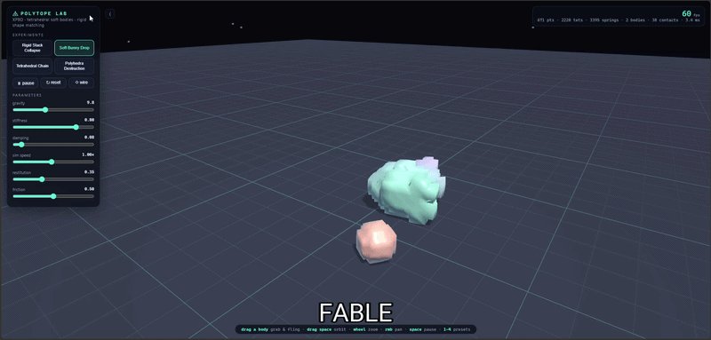
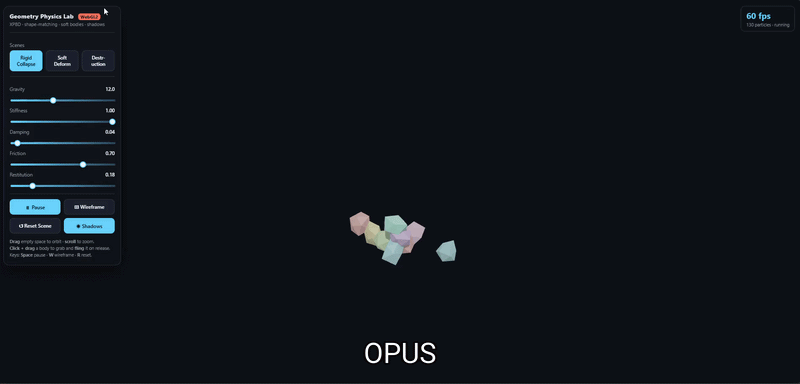
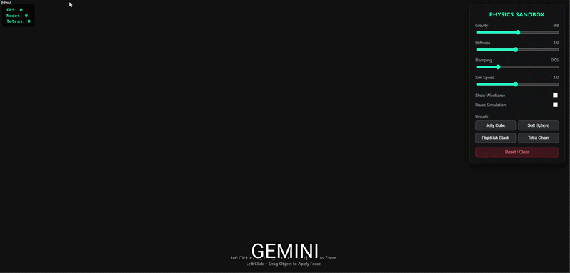

<div align="center">

# 🧪 One-Shot Physics Engine Benchmark

### *Nine frontier models. One prompt. No follow-ups. Open the file and see what happens.*


[📄 Paper](#-the-paper) · [▶️ Try the Outputs](#-try-the-outputs) · [📋 The Prompt](#-the-prompt) · [📊 Results](#-results)

---

</div>

## What this is

Fable 5 launched on June 9, 2026 with benchmark scores that looked like a real step change. I wanted to see what those numbers actually meant in practice.

So I wrote one prompt — a real-time 3D physics engine, tetrahedral soft bodies, shadow mapping, collision detection, particles, all in a single HTML file with no libraries — and ran it unchanged across nine frontier models. No follow-ups. No adjusting the prompt per model. Whatever came out is what's in this repo.

Of nine models, two produced working simulations. The rest failed, and each failure reveals something specific about where these models actually break down.

This wasn't a test of how developers normally work. It was a ceiling test. The ceiling turned out to be a lot closer than the benchmarks suggest for most models, and much further than expected for two of them.

---

## Results

| Model | Lines | Solver | Result |
|-------|-------|--------|--------|
| 🥇 **Fable 5** | 1,536 | XPBD (Macklin et al.) | ✅ **WORKING** — 671 pts · 2,220 tets · 3,395 springs |
| 🥈 **Opus 4.8** | 1,139 | XPBD + shape matching | ✅ **WORKING** — particles · PCF shadows |
| Sonnet 4.6 | 1,869 | PBD constraints | 🟡 UI renders, physics dead |
| Haiku 4.5 | 1,520 | AABB + Verlet | 🟡 UI renders, canvas empty |
| Mistral Think | 3,779 | GJK + EPA | ❌ Black screen — 6min 47s thinking, FPS: 0 |
| Gemini Pro | 1,121 | Constraint-based | 🟡 UI renders, FPS: 0, Nodes: 0 |
| Grok | 2,359 | SAT + impulse | ❌ Did not render |
| DeepSeek | 2,298 | Mass-spring + SAT | ❌ Did not render |
| ChatGPT | 529 | Mass-spring (Hooke) | ❌ Did not render |

The most surprising finding isn't that Fable 5 won. It's that Opus 4.8 also shipped a working simulation while Grok (paid), Mistral Think (nearly 7 minutes of reasoning), and Sonnet 4.6 (Claude's own mid-tier model) all produced nothing functional. Capability on this class of task does not scale linearly with model size, price tier, or reasoning time.

---

## What it actually looks like

**The two that worked:**

<table>
<tr>
<td align="center"><b>Fable 5</b> — 671 pts · 2,220 tets · 3,395 springs</td>
<td align="center"><b>Opus 4.8</b> — XPBD + shape matching · PCF shadows</td>
</tr>
<tr>
<td></td>
<td></td>
</tr>
</table>

**Everyone else** (representative — Gemini Pro, 1,121 lines, FPS: 0, Nodes: 0, Tetras: 0):



> UI rendered correctly. Sliders, presets, FPS counter — all there. The simulation underneath was completely dead. This is the most common failure pattern in the dataset.

---

## Try the outputs

Single HTML files. Download and open in any WebGL2 browser. No server needed.

```
outputs/
├── Fable_5.html               ✅ Working — XPBD soft bodies, PCF shadows, spark particles
├── Opus.html                  ✅ Working — XPBD + shape matching, PCF shadows
├── Sonnet.html                🟡 Shell — UI renders, physics dead
├── Haiku.html                 🟡 Shell — UI renders, canvas empty
├── Mistrial_Vibe_think.html   ❌ Black screen (6min 47s of reasoning)
├── Goole_pro.html             🟡 Shell — FPS: 0, Nodes: 0, Tetras: 0
├── Grok.html                  ❌ Did not render
├── Deepseek.html              ❌ Did not render
└── OPENAI.html                ❌ Did not render
```

---

## The prompt

One prompt, used unchanged across all nine models. The only modification was swapping `[model name]` for each model's actual name as shown in its interface.

<details>
<summary><b>Full prompt (click to expand)</b></summary>

```
You are [model name]. You have:

* Adaptive Thinking always enabled: Think deeply, step-by-step, reflect on your
  reasoning, critique your own output, and iterate before finalizing.
* Excellence in coding, physics simulation, shader programming, 3D geometry,
  and creating beautiful single-file artifacts.
* Access to tools/computer use where available — use them proactively if needed.

Core rules for this session:
1. Maximum Effort Mode: Treat this as the most important project you've ever
   worked on. Use your full intelligence, creativity, and rigor.
2. Iterative Perfection: Plan thoroughly → Execute → Self-critique → Refine → Validate.
3. Breakthrough Thinking: Challenge assumptions and aim for elegant, novel, stable solutions.
4. Output Quality: Deliver production-ready, heavily commented, visually stunning results.

Create a single, complete, self-contained HTML file that implements a real-time
3D physics simulation with complex geometry using WebGL2 (vanilla, no external libraries).

Focus: Complex geometry physics — support rigid and/or soft bodies with non-trivial
meshes (tetrahedral decomposition, convex polyhedra, or simple manifold meshes).

Core requirements:
* Procedurally generate or define complex 3D shapes (e.g. Stanford Bunny-like mesh,
  irregular polyhedra, stacked objects, or a ragdoll-like figure).
* Implement solid physics: rigid body dynamics with proper collision detection/response
  for complex geometry (GJK, SAT, or tetrahedral-based), OR a tetrahedral mass-spring /
  finite-element soft body system for deformable objects.
* Features: Gravity, friction, restitution, mouse orbit camera + click-and-drag
  to throw/apply forces.
* Visuals: Phong/Blinn lighting, basic shadows, wireframe toggle, colorful materials,
  particle effects on impacts/breaks.
* UI: Sliders for gravity, stiffness (soft bodies), damping, simulation speed;
  presets like "Rigid Stack Collapse", "Soft Bunny Drop", "Tetrahedral Chain",
  "Complex Polyhedra Destruction".
* Responsive full-window canvas, FPS counter, pause/play, reset, on-screen instructions.
* Performance: Stable and smooth (aim for 30-60fps).

Style: Visually impressive scientific/artistic hybrid — mesmerizing deformable and
rigid objects interacting with nice lighting and camera controls.

Deliver only the full HTML code inside one markdown code block.
Heavily comment the key physics, geometry, and shader sections.
Use adaptive thinking throughout.
```

</details>

---

## What the failures actually mean

| Type | Models | What happened |
|------|--------|---------------|
| **Type I · Scope Failure** | ChatGPT | Knew what physics looks like, couldn't build the real version. Mass-spring instead of XPBD, no collision, no shadows. |
| **Type II · Integration Failure** | DeepSeek, Grok | Right architecture, wrong result. Every subsystem was there — SAT collision, shadow FBO, tetrahedral mesh — but the assembled system didn't run. |
| **Type III · Shell Failure** | Gemini, Sonnet, Haiku | Built a correct interface around dead physics. Looks right until you try to use it. |
| **Type IV · Reasoning-Execution Gap** | Mistral Think | Identified the right approach repeatedly — tetrahedral decomposition, GJK, XPBD — then reasoned itself out of each one. The model knew the answer and chose not to write it. |

---

## The technical dividing line

Only Fable 5 and Opus 4.8 implemented XPBD (Extended Position-Based Dynamics, Macklin et al. 2014). Every other model used mass-spring networks — easier to write, less stable, less physically correct. Choosing XPBD isn't cosmetic. It requires actually understanding physics simulation rather than pattern-matching on physics simulation code.

Both models that chose XPBD produced working simulations. No model that didn't choose it did.

Code volume tells the opposite story — Mistral Think at 3,779 lines and DeepSeek at 2,298 both failed completely. Fable 5 at 1,536 lines shipped 2,220 tetrahedra. More code meant less understanding, not more.

---

## The paper

Full writeup with methodology, per-model analysis, reasoning trace breakdowns, failure taxonomy, and charts.

📄 [`paper/physics_benchmark_VanNostrand.docx`](./paper/physics_benchmark_VanNostrand.docx)

---

## Repo structure

```
one-shot-physics-benchmark/
├── README.md
├── PROMPT.md
├── media/
│   ├── FABLE__2_.gif          ← embed in README
│   ├── OPUS.gif               ← embed in README
│   └── GEMNI.gif              ← embed in README
├── outputs/
│   ├── Fable_5.html
│   ├── Opus.html
│   ├── Sonnet.html
│   ├── Haiku.html
│   ├── Mistrial_Vibe_think.html
│   ├── Goole_pro.html
│   ├── Grok.html
│   ├── Deepseek.html
│   └── OPENAI.html
└── paper/
    └── physics_benchmark_VanNostrand.docx
```

---

## References

- Macklin, M. et al. (2014). *Unified Particle Physics for Real-Time Applications.* ACM TOG 33(4).
- Müller, M. et al. (2007). *Position Based Dynamics.* JVCIR 18(2).
- Freudenthal, H. (1942). *Simplizialzerlegungen von Beschränkter Flachheit.* Annals of Math 43(3).

---

<div align="center">

**Adam Van Nostrand** · Independent Researcher · Columbia, SC

[](https://www.linkedin.com/in/adam-van-nostrand-5a603424b/)
[](https://github.com/advannostrand/9LLMWEBGL)

*Evaluated June 10, 2026. No prompt engineering. No follow-ups. No cherry-picking. Open the file.*

</div>
